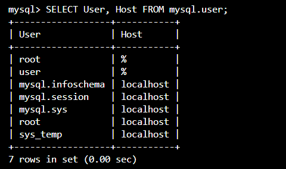
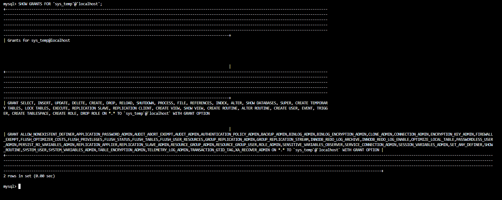
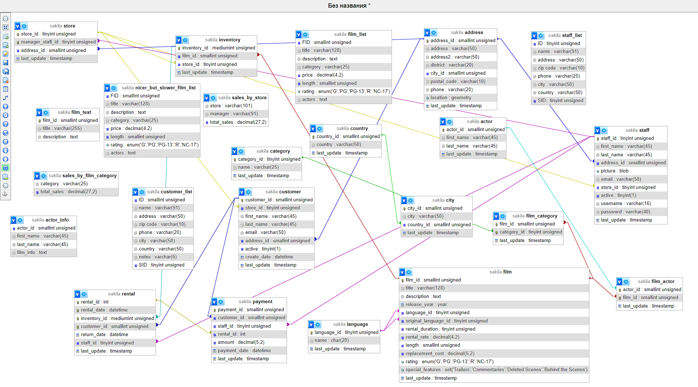

# Домашнее задание к занятию "`Работа с данными (DDL/DML)`" - `Виталий Коряко`

https://github.com/netology-code/sdb-homeworks/blob/main/12-02.md

Для подключения из dbveaver может потребоваться https://stackoverflow.com/questions/61749304/connection-between-dbeaver-mysql

### Задание 1
1.1. Поднимите чистый инстанс MySQL версии 8.0+. Можно использовать локальный сервер или контейнер Docker.

1.2. Создайте учётную запись sys_temp. 

1.3. Выполните запрос на получение списка пользователей в базе данных. (скриншот)

1.4. Дайте все права для пользователя sys_temp. 

1.5. Выполните запрос на получение списка прав для пользователя sys_temp. (скриншот)

1.6. Переподключитесь к базе данных от имени sys_temp.

Для смены типа аутентификации с sha2 используйте запрос: 
```sql
ALTER USER 'sys_test'@'localhost' IDENTIFIED WITH mysql_native_password BY 'password';
```
1.6. По ссылке https://downloads.mysql.com/docs/sakila-db.zip скачайте дамп базы данных.

1.7. Восстановите дамп в базу данных.

1.8. При работе в IDE сформируйте ER-диаграмму получившейся базы данных. При работе в командной строке используйте команду для получения всех таблиц базы данных. (скриншот)

*Результатом работы должны быть скриншоты обозначенных заданий, а также простыня со всеми запросами.*


### Решение 1

#### Вспомогательные команды для работы с окружением
[helpers](./helpers.txt)

#### Создан sys_temp



#### Для sys_temp получены права


#### Получены таблицы для sakila db


#### Получена er диаграмма для sakila db


#### Простыня команд
[logs](./logs.txt)

---

### Задание 2
Составьте таблицу, используя любой текстовый редактор или Excel, в которой должно быть два столбца: в первом должны быть названия таблиц восстановленной базы, во втором названия первичных ключей этих таблиц. Пример: (скриншот/текст)
```
Название таблицы | Название первичного ключа
customer         | customer_id
```

### Решение 2

```
SELECT TABLE_SCHEMA, TABLE_NAME, COLUMN_NAME, DATA_TYPE
FROM INFORMATION_SCHEMA.COLUMNS
WHERE TABLE_SCHEMA = 'sakila'
AND COLUMN_KEY = 'PRI'
ORDER BY table_name;
```

```
+--------------+---------------+--------------+-----------+
| TABLE_SCHEMA | TABLE_NAME    | COLUMN_NAME  | DATA_TYPE |
+--------------+---------------+--------------+-----------+
| sakila       | actor         | actor_id     | smallint  |
| sakila       | address       | address_id   | smallint  |
| sakila       | category      | category_id  | tinyint   |
| sakila       | city          | city_id      | smallint  |
| sakila       | country       | country_id   | smallint  |
| sakila       | customer      | customer_id  | smallint  |
| sakila       | film          | film_id      | smallint  |
| sakila       | film_actor    | actor_id     | smallint  |
| sakila       | film_actor    | film_id      | smallint  |
| sakila       | film_category | film_id      | smallint  |
| sakila       | film_category | category_id  | tinyint   |
| sakila       | film_text     | film_id      | smallint  |
| sakila       | inventory     | inventory_id | mediumint |
| sakila       | language      | language_id  | tinyint   |
| sakila       | payment       | payment_id   | smallint  |
| sakila       | rental        | rental_id    | int       |
| sakila       | staff         | staff_id     | tinyint   |
| sakila       | store         | store_id     | tinyint   |
+--------------+---------------+--------------+-----------+

Если посмотреть на задание 1, то там команда SHOW TABLES вывела ещё ряд сущностей, которых нет в результатах выполненного запроса.
Это представления, поэтому они не вошли
+----------------------------+
| actor_info                 |
| customer_list              |
| film_list                  |
| nicer_but_slower_film_list |
| sales_by_film_category     |
| sales_by_store             |
| staff_list                 |
+----------------------------+
```

---

## Дополнительные задания (со звёздочкой*)
Эти задания дополнительные, то есть не обязательные к выполнению, и никак не повлияют на получение вами зачёта по этому домашнему заданию. Вы можете их выполнить, если хотите глубже шире разобраться в материале.

### Задание 3*
3.1. Уберите у пользователя sys_temp права на внесение, изменение и удаление данных из базы sakila.

3.2. Выполните запрос на получение списка прав для пользователя sys_temp. (скриншот)

*Результатом работы должны быть скриншоты обозначенных заданий, а также простыня со всеми запросами.*